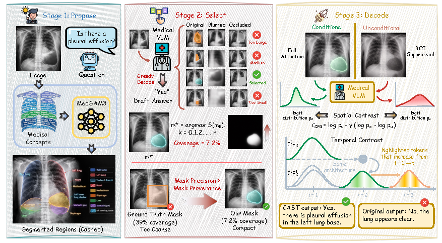

# [MICCAI 2026] Counterfactual Anatomy-guided Spatial-Temporal Decoding for Annotation-Free Hallucination Mitigation in Medical VLMs

## Abstract

Medical vision-language models (Med-VLMs) have demonstrated strong performance on medical visual question answering, yet they remain prone to hallucination, generating clinically unsupported statements that are insufficiently grounded in image evidence. Mitigation methods applied during decoding offer a practical solution, but they typically lack anatomical awareness or rely heavily on ground truth annotations, which limits their applicability. We propose Counterfactual Anatomy-guided Spatial-Temporal decoding (CAST), a framework that operates entirely during inference and requires no manual annotations for anatomically grounded hallucination mitigation. CAST automatically discovers anatomical regions relevant to the given query through broad medical segmentation. It then selects a compact, causally informative area using counterfactual intervention based on the drop in answer likelihood under occlusion. Guided by this chosen region, CAST performs a unified contrastive decoding process, combining classifier-free guidance to correct spatial attention with stepwise temporal contrast to regulate generation dynamics. Experiments on the SLAKE and MIMIC-CXR datasets across three Med-VLMs demonstrate that CAST consistently outperforms strong baselines and surpasses decoding strategies reliant on ground truth. Our results indicate that compact, automatically selected regions provide highly effective contrastive guidance without expert annotations, offering a practical and generalizable solution for improving spatial grounding and reducing hallucinations.

<p align="center">
  
</p>

## Method Overview

CAST is a training-free, annotation-free decoding framework that improves Medical VLM accuracy by automatically discovering question-relevant anatomical regions and using them for spatially-guided contrastive decoding. It operates in three stages:

1. **Anatomical Proposal Generation** — MedSAM3 generates region proposals from medical images using 46 anatomical concept prompts in a single forward pass.
2. **Counterfactual ROI Selection** — For each question, the most relevant region is selected by measuring the likelihood drop when each candidate region is occluded (dual occlusion: Gaussian blur + mean fill).
3. **Spatial-Temporal Contrastive Decoding** — The selected ROI guides classifier-free guidance (CFG) decoding, where the conditional branch attends to the full image and the unconditional branch masks out ROI tokens.

## Installation

```bash
git clone https://github.com/YOUR_USERNAME/CAST.git
cd CAST
pip install -r requirements.txt
```

### External Dependencies

- **MedSAM3**: Clone [MedSAM3](https://github.com/YOUR_LINK/MedSAM3) and provide the path via `--medsam3_path`.
- **LLaVA-Med** (optional): Required only for `evaluate_llava_med.py`. Provide code path via `--llava_med_code_path`.
- **HuatuoGPT-Vision** (optional): Required only for `evaluate_huatuo.py`. Provide code path via `--huatuo_code_path`.

## Usage

### Phi-3.5V-Med on SLAKE

```bash
python evaluate_slake.py \
    --mode auto \
    --model_path /path/to/Phi-3.5-vision-instruct \
    --lora_path /path/to/Phi-3.5V-Med \
    --input_path /path/to/SLAKE/test.json \
    --img_root /path/to/SLAKE \
    --medsam3_config /path/to/MedSAM3/configs/full_lora_config.yaml \
    --medsam3_weights /path/to/best_lora_weights.pt \
    --medsam3_path /path/to/MedSAM3 \
    --cache_dir cache/slake_proposals
```

### Phi-3.5V-Med on MIMIC

```bash
python evaluate_mimic.py \
    --mode auto \
    --model_path /path/to/Phi-3.5-vision-instruct \
    --lora_path /path/to/Phi-3.5V-Med \
    --input_path /path/to/MIMIC-CXR-JPG/test_region_vqa.json \
    --img_root /path/to/MIMIC-CXR-JPG/files \
    --medsam3_config /path/to/MedSAM3/configs/full_lora_config.yaml \
    --medsam3_weights /path/to/best_lora_weights.pt \
    --cache_dir cache/mimic_proposals
```

### LLaVA-Med

```bash
python evaluate_llava_med.py \
    --dataset slake --mode auto \
    --model_path /path/to/llava-med-v1.5-mistral-7b \
    --llava_med_code_path /path/to/MedEvalKit \
    --input_path /path/to/SLAKE/test.json \
    --img_root /path/to/SLAKE \
    --skip_proposal_gen
```

### HuatuoGPT-Vision-7B

```bash
python evaluate_huatuo.py \
    --dataset slake --mode auto \
    --model_path /path/to/HuatuoGPT-Vision-7B \
    --huatuo_code_path /path/to/HuatuoGPT-Vision \
    --input_path /path/to/SLAKE/test.json \
    --img_root /path/to/SLAKE \
    --skip_proposal_gen
```

### Mask Modes

All evaluation scripts support three modes via `--mode`:

| Mode | Description |
|------|-------------|
| `auto` | CAST automatic ROI discovery (default) |
| `gt` | Ground-truth masks (upper bound) |
| `null` | No ROI guidance (baseline) |

## Project Structure

```
CAST/
├── cast/                         # Core method package
│   ├── __init__.py               # Public API exports
│   ├── proposal_generator.py     # Stage 1: MedSAM3 anatomical proposals
│   ├── roi_selection.py          # Stage 2: Counterfactual ROI selection
│   ├── mask_provider.py          # Mask provider interface (Auto/GT/Null)
│   ├── cache.py                  # Proposal caching
│   ├── guidance.py               # Stage 3: Spatial CFG logits processor
│   └── utils.py                  # Utility functions
├── evaluate_slake.py             # SLAKE evaluation (Phi-3.5V-Med)
├── evaluate_mimic.py             # MIMIC evaluation (Phi-3.5V-Med)
├── evaluate_llava_med.py         # LLaVA-Med evaluation
├── evaluate_huatuo.py            # HuatuoGPT-Vision evaluation
├── requirements.txt
└── README.md
```

## License

This project is released under the MIT License.
